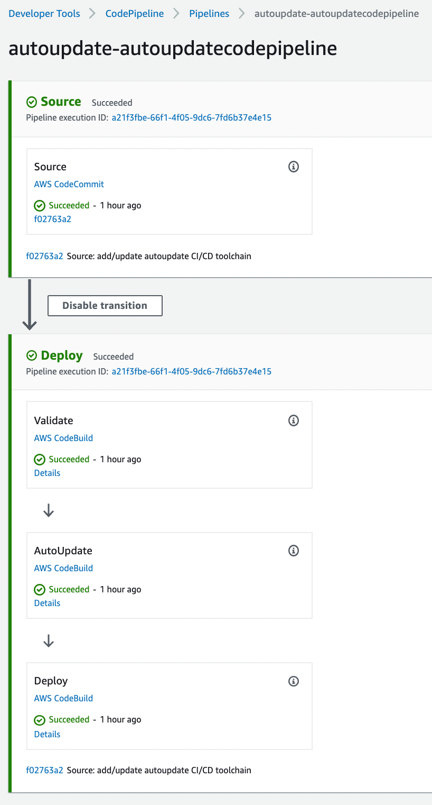

# What is "starter"
Starter is a `DevOps` kit to build everything by code. I hope this code will help none-DevOps user to work using DevOps principals like IaC, Immutability, Reproducibility. 

# How to start
## prerequisits
To Start, you need:
- An AWS Account. You can create a free tier account following this link, https://aws.amazon.com/free/

- Install the AWS CLI tool on you working environment. you could follow this link for help, https://docs.aws.amazon.com/cli/index.html
  
- Check your aws cli connectivity to the target account
  ```
  aws sts get-caller-identity
  {
    "UserId": "AAAAAAAAAAAAAAAAAAAAA",
    "Account": "123456789012",
    "Arn": "arn:aws:iam::123456789012:user/laurent"
  } 
  ````


- Install git on you working environment. You could follow this link for help, https://git-scm.com/download/mac

- Install Python3, https://www.python.org/downloads/. Check that pip is installed as well with the commande ``pip --version``

- Install git-remote-codecommit with the command bellow
  ```
  pip install git-remote-codecommit
  ```


## The kit contains different starters:

- AWS-CFN-CCommit-CPipeline-Cbuild --> Coded in Cloudformation, using codecommit, codepipeline and codebuild
- AWS-CFN-GitHub-CPipeline-Cbuild --> Coded in clouformation, using github, codepipeline ad codebuild
- AWS-TRF-CCommit-CPipeline-Cbuild --> Coded in terraform OSS, using codecommit, codepipeline and codebuild
- AWS-TRF-GitHub-CPipeline-Cbuild --> Coded in terraform OSS, using github, codepipeline ad codebuild


## All kit will deploy a standard CI/CD pipeline as bellow:


## CI/CD pipeline code in `./toolchain`
All the code of the CI/CD pipeline is into the folder `/toolchain`

```
|-toolchain:
  |- autoupdate.yml
  |- scripts
    |- autoupdate-deploy.sh
    |- deploy.sh
    |- validate.sh
```

## Using the deployed CI/CD pipeline
After the run of the tool to initial the installation of the pipeline into your AWS Account:
- you can use the local copy of the repository to add new code, update the tasks of the toolchain to deploy your new code. 
- Then commit the changes to trigger the pipeline to run and deploy your code.
- You may have to configure pre-commit hook to have your local copy usable (For Amazonian, run `git-defender --setup`)


# Deploy a kit: 

## prerequisit:
Get a local copy of this repository.

## AWS-CFN-CCommit-CPipeline-Cbuild
cd into the folder AWS-CFN-CCommit-CPipeline-Cbuild and run init-deploy.sh

```
cd ./AWS-CFN-CCommit-CPipeline-Cbuild
bash init-deploy.sh -h
Usage: init-deploy.sh [-h] [-c <repo-name> -p <path> [-f]]
This script helps customer to deploy this DevOps starter kit in an AWS Account.
    -h          display this help and exit
    -c <repo>   codecommit name
    -p <path>   path where to checkout the local copy of the repository
    -f          force repository fresh checkout even local copy found         
```
Select a name for your repository and select a path (local) where the newly created repository will be localy checkout for your local copy. you will use this local copy to create and deploy your IaC code and more (as you need)

As a sample, 
```
bash init-deploy.sh -c my-application-repo -p /tmp
```


## AWS-CFN-GitHub-CPipeline-Cbuild 

cd into the folder AWS-CFN-GtHub-CPipeline-Cbuild and look at the tool usage

```
cd ./AWS-CFN-GitHub-CPipeline-Cbuild
bash init-deploy.sh -h
Usage: init-deploy.sh [-h] [-t <token> -o <owner> -r <repo> -p <path>] 
This script helps customer to deploy this DevOps starter kit in an AWS Account.
    -h          display this help and exit
    -t <token>  github token
    -o <owner>  github owner
    -r <repo>   github repo name
    -p <path>   github local clone path

```

Using a Github repository, you have to create or get the info about it:
- the github owner
- the git repository name
- the git token used to access it
- You should also have a usable local copy of this repo

Then use the tool to initiate the deployment of your CI/CD pipeline, as an exemple bellow:
```
bash init-deploy.sh -t ghp_token -o gituser -r reponame -p /tmp/reponame
```


## AWS-TRF-CCommit-CPipeline-Cbuild
cd into the folder AWS-TF-CCommit-CPipeline-Cbuild and run ini-deploy.sh

```
cd ./AWS-TRF-CCommit-CPipeline-Cbuild
bash init-deploy.sh -h
Usage: init-deploy.sh [-h] [-c <repo-name> -p <path> [-f]]
This script helps customer to deploy this DevOps starter kit in an AWS Account.
    -h          display this help and exit
    -c <repo>   codecommit name
    -p <path>   path where to checkout the local copy of the repository
    -f          force repository fresh checkout even local copy found
    -d          destroy stack       
```
Select a name for your repository and select a path (local) where the newly created repository will be localy checkout for your local copy. you will use this local copy to create and deploy your IaC code and more (as you need)

As a sample, 
```
bash init-deploy.sh -c my-application-repo -p /tmp
```

## AWS-TRF-GitHub-CPipeline-Cbuild
TO COME SOON


